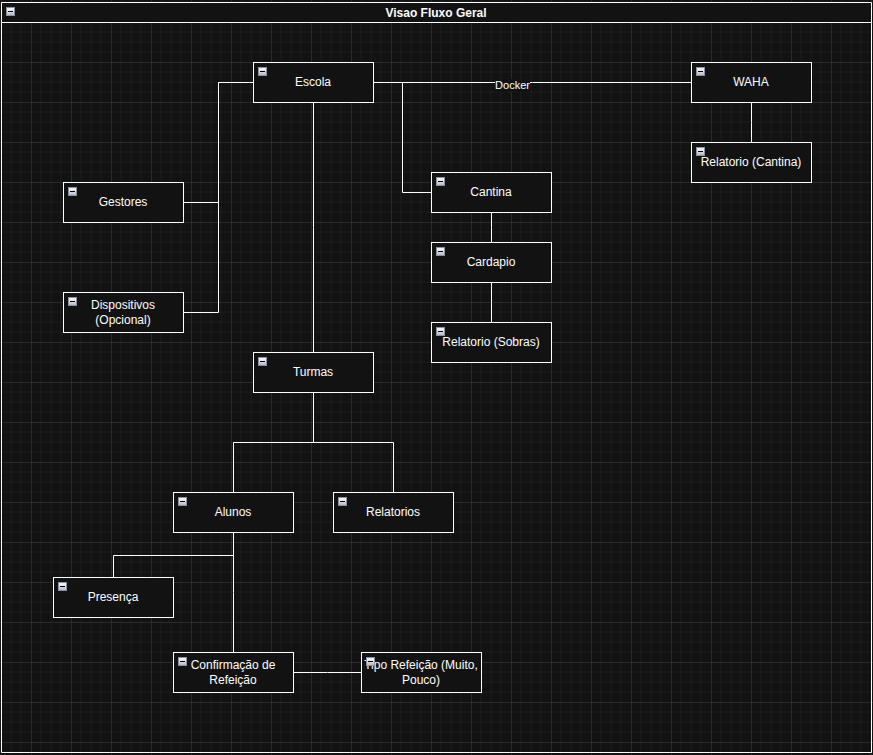
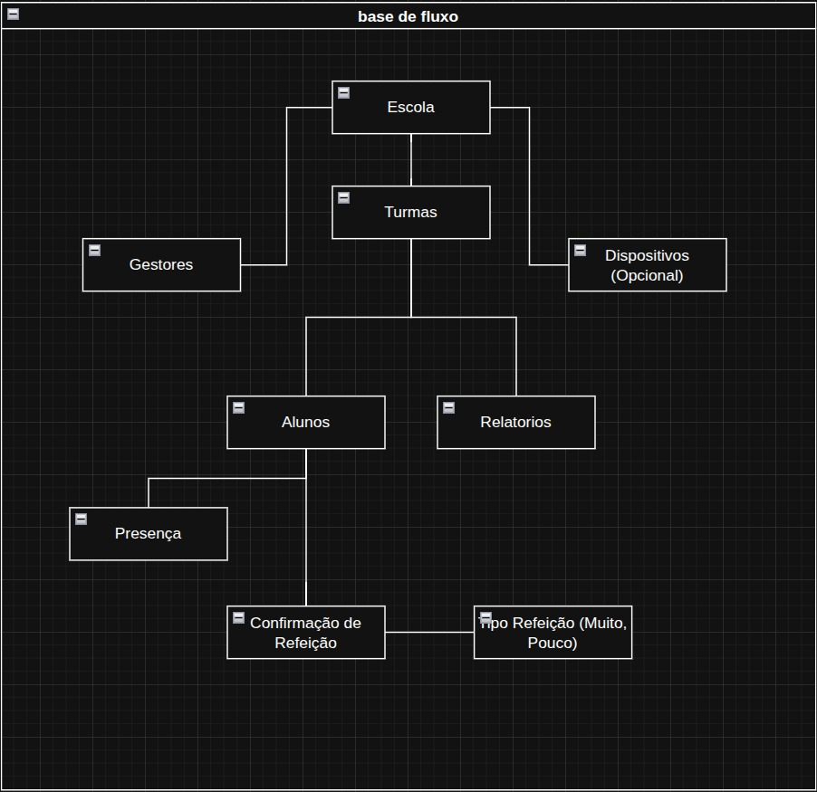
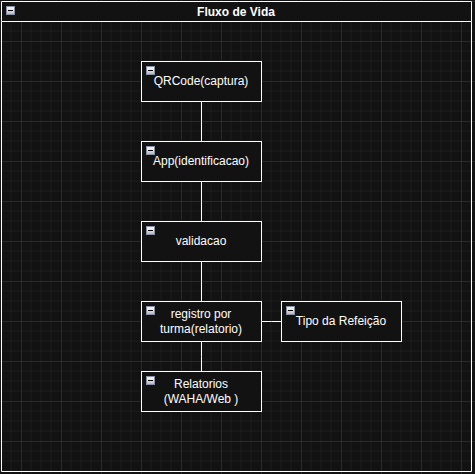

# Sistema de Gestão de Presença e Merenda Escolar

## Visão Geral

O sistema monitora, por meio da carteirinha estudantil, a presença dos alunos na escola, permitindo:
 
- Registro de frequência escolar - presença de alunos na instituição.
- Contagem automática de refeições para a cantina - alimentação com base na mesma leitura de presença.
- Gestão da cantina: cardápio diário, controle de sobras e relatórios de movimentação.
- Envio automático de relatórios de contagem para a equipe da cantina via WhatsApp.

---

## Objetivo e critério de sucesso
 
- Gestão eficiente da merenda escolar, com quantidade de refeições calculada a partir de dados reais de presença.
- Frequência dos alunos registrada de forma organizada e auditável.
- Redução de desperdício de comida, a partir do cruzamento entre cardápio, quantidade de alunos e sobras.

---

## Escopo do projeto
 
### MVP (fase 1)
 
- Cadastro de escola, gestores, turmas, alunos e dispositivos.
- Importação em massa de alunos via planilha, com geração automática de QR code e exportação de carteirinhas em PDF.
- Leitura de presença e refeição via scanner(maquina) fixo(a) na entrada da escola.
- Contagem automática de presença e das três refeições do dia.
- Relatórios de presença e de contagem de refeições.
- Envio automático dos relatórios de contagem para a cantina via WhatsApp.
### Fase 2 — Gestão de cantina
 
- Cadastro de cardápio diário.
- Registro de sobra (peso total preparado vs. peso total que sobrou).
- Relatório mensal cruzando cardápio, quantidade de alunos por tipo de refeição e sobras, para análise de movimentação e desperdício.
### Fora de escopo (avaliado e descartado por ora)
 
- **Reconhecimento facial via IA**: avaliado como alternativa à carteirinha QR. Descartado no momento por exigir tratamento de dado biométrico sensível de menores (LGPD + ECA), custo de hardware mais alto e maior complexidade de manutenção, sem resolver um problema que o projeto tem hoje.
- **App mobile como leitor principal / site web como interface de leitura**: descartados como interface primária de leitura em favor da maquina fixa. Um app mobile pode ser reavaliado no futuro como ferramenta administrativa complementar (consulta de relatórios, cadastro emergencial).

---

## 👥 Perfis e Permissões
 
O sistema opera com um sistema de permissões hierárquico. Cada perfil possui responsabilidades bem definidas dentro da plataforma.
 
**Direção**
- Acesso total à plataforma
- Configura horários de corte de presença e horários de envio de relatórios
- Cadastra gestores
- Acumula todas as permissões de Coordenador e Monitor

**Coordenador**
- Cadastra e edita alunos e turmas
- Importa alunos em massa via planilha
- Acessa relatórios completos de presença e refeições
- Acumula todas as permissões de Monitor

**Monitor**
- Acompanha a máquina de leitura no dia a dia
- Resolve problemas pontuais (ex: aluno sem carteirinha)
- Consulta a presença do dia

**Cantina**
- Cadastra o cardápio diário
- Registra as sobras (Fase 2)
- Visualiza relatórios de contagem de refeição
- Não tem acesso a dados de frequência escolar dos alunos

---

## Arquitetura da solução
 
### Hardware
 
- **Computador Fixa** na entrada da escola, com **câmera acoplada** lendo o QR code da carteirinha.
- Único computador atende aos três momentos do dia: lanche da manhã, almoço e lanche da tarde.
- A pagina exibe os botões de escolha "Normal" / "Pouco" apenas para o momento do almoço.
### Fluxo de leitura no Sistema
 
1. Aluno aproxima a carteirinha da câmera.
2. Sistema confirma a leitura (nome e turma exibidos brevemente).
3. Para o momento do almoço, aluno escolhe o tipo de porção (Normal ou Pouco) na pagina.
4. Confirmação visual de sucesso, aluno segue para a fila.
A tela de confirmação se limpa automaticamente em poucos segundos, sem exigir interação, para não gerar gargalo na fila.
 
### Stack 
 
| Camada | Tecnologia sugerida | Motivo |
|---|---|---|
| Aplicação da maquina | Pagina Web, leitura via câmera | Roda direto na máquina fixa da entrada |
| Backend | Python (Django Ninja) | Baixo consumo de recursos, adequado a servidor modesto |
| Banco de dados | PostgreSQL | Volume de dados baixo, não exige infraestrutura pesada |
| Envio de relatório | WAHA (WhatsApp HTTP API, não oficial) | Menor custo/complexidade que a API oficial da Meta — ver ADR-002 |
| Infra | Docker/Docker Compose | Conteinerização utilizada para rodar e gerenciar a aplicação como um todo.

## Tecnologias
 
### Front-end
 
- HTML: estrutura da página exibida na máquina de leitura.
- CSS: estilização visual da página.
- JavaScript: comportamento interativo da página — acesso à câmera para leitura do QR code, exibição da confirmação de leitura e dos botões de escolha de refeição, comunicação com o backend.
### Backend
 
- Python 3.12+: linguagem principal utilizada no backend.
- Django / Django Ninja: framework de desenvolvimento web backend.
- PostgreSQL: banco de dados utilizado para persistência de dados.
### Infra
 
- Docker: conteinerização da aplicação, gerenciada como um todo.
- Docker Compose: gerenciador de containers a partir do Docker.
## Fluxogramas do projeto
 
Os diagramas abaixo foram construídos ao longo do desenho da solução e representam três níveis diferentes de detalhe do mesmo sistema: da visão macro (todos os módulos) até o ciclo de vida de uma única leitura.
 
### 1. Visão geral do fluxo
 

 
Mapa completo dos módulos do sistema e como eles se relacionam. A partir da **Escola**, derivam três ramos principais:
 
- **Gestores** e **Dispositivos**: cadastro de quem acessa o sistema e quais máquinas fazem leitura.
- **Turmas → Alunos**: cadastro acadêmico, do qual derivam **Presença** (frequência) e **Confirmação de Refeição** (com o **Tipo de Refeição** — Normal/Pouco — associado no momento do almoço).
- **Cantina → Cardápio → Relatório (Sobras)**: módulo da Fase 2, cadastro do cardápio diário e controle de desperdício.
O bloco **WAHA**, conectado à Escola via **Docker**, representa o serviço responsável por enviar o **Relatório (Cantina)** automaticamente pelo WhatsApp — ver [Integração com WhatsApp](#integração-com-whatsapp) e [ADR-002](#adr-002-envio-de-relatórios-via-whatsapp-usando-waha) para o detalhamento dessa decisão.
 
### 2. Base de fluxo (núcleo de presença e refeição)
 

 
Recorte do fluxo geral, isolando apenas o núcleo de **Escola → Turmas → Alunos**, sem os módulos de cantina e envio de relatório. Usado como referência rápida para o funcionamento central do MVP: cadastro acadêmico gerando **Presença** e **Confirmação de Refeição** (com o respectivo **Tipo de Refeição**).
 
### 3. Fluxo de vida de uma leitura
 

 
Detalha o ciclo de uma leitura individual, do momento da captura até a geração de relatório:
 
1. **QRCode (captura)**: a câmera lê o QR code da carteirinha.
2. **App (identificação)**: o sistema identifica a qual aluno pertence aquele código.
3. **Validação**: checagem de duplicidade e das regras de negócio (horário de corte, momento do dia).
4. **Registro por turma (relatório)**: a leitura validada é agregada por turma, junto ao **Tipo da Refeição** quando aplicável (almoço).
5. **Relatórios**: consolidação final, consumida pelos gestores e pela cantina.
*Observação: ajuste os caminhos das imagens (`docs/diagramas/...`) acima conforme a pasta real onde os prints estão salvos no seu repositório.*

---

## Entidades e Módulos
 
### Módulo `school`
 
#### `School`
 
Representa a instituição de ensino e concentra as configurações gerais usadas pelos demais módulos.
 
| Campo | Descrição |
|---|---|
| `id` | Identificador único da escola |
| `name` | Nome da instituição |
| `time_closing_presence` | Horário de corte para presença dentro do prazo (ex: 09:00) |
| `time_send_snack_morning` | Horário de envio automático do relatório do lanche da manhã via WhatsApp |
| `time_send_lunch` | Horário de envio automático do relatório do almoço via WhatsApp |
| `time_send_snack_afternoon` | Horário de envio automático do relatório do lanche da tarde via WhatsApp |
| `number_whats` | Número de WhatsApp da cantina, destino dos relatórios automáticos |
| `created_at` | Data e hora de criação do registro |
 
#### `Manager`
 
Representa os usuários do sistema (gestores) — Direção, Coordenador, Monitor e Cantina.
 
| Campo | Descrição |
|---|---|
| `id` | Identificador único do gestor |
| `school_id` | Escola à qual o gestor pertence |
| `role` | Perfil de acesso (`direction`, `coordinator`, `monitor`, `canteen`), define as permissões dentro do sistema |
| `name` | Nome do gestor |
| `email` | E-mail usado para login, único no sistema |
| `password` | Senha de acesso, armazenada com hash |
| `active` | Indica se o gestor ainda está ativo (exclusão lógica) |
| `created_at` | Data e hora de criação do registro |
 
### Módulo `academic`
 
#### `Classroom`
 
Representa uma turma da escola, usada para agrupar os alunos.
 
| Campo | Descrição |
|---|---|
| `id` | Identificador único da turma |
| `school_id` | Escola à qual a turma pertence |
| `name` | Nome/identificação da turma (ex: "9º Ano A") |
| `active` | Indica se a turma ainda está em funcionamento (exclusão lógica) |
| `created_at` | Data e hora de criação do registro |
 
#### `Student`
 
Representa o aluno, identificado unicamente pelo QR code de sua carteirinha estudantil.
 
| Campo | Descrição |
|---|---|
| `id` | Identificador único do aluno |
| `classroom_id` | Turma à qual o aluno pertence |
| `name` | Nome do aluno |
| `RA` | Registro acadêmico/matrícula do aluno, único no sistema |
| `qr_code` | Código único gerado para a carteirinha estudantil, usado na leitura |
| `active` | Indica se o aluno ainda está matriculado (exclusão lógica) |
| `created_at` | Data e hora de criação do registro |
 
### Módulo `presence`
 
Núcleo do sistema — registra o evento bruto de leitura e as duas interpretações derivadas dele: presença e contagem de refeição.
 
#### `Readings`
 
Log bruto de cada leitura realizada na máquina da entrada. Nunca é apagado, funciona como auditoria de tudo que já aconteceu.
 
| Campo | Descrição |
|---|---|
| `id` | Identificador único da leitura |
| `student_id` | Aluno identificado na leitura |
| `moment` | Momento do dia em que a leitura ocorreu (`snack_morning`, `lunch`, `snack_afternoon`) |
| `date_time` | Data e hora exatas da leitura |
 
#### `Frequency`
 
Registro de presença — um único registro por aluno, por dia, gerado a partir da primeira leitura.
 
| Campo | Descrição |
|---|---|
| `id` | Identificador único do registro de presença |
| `student_id` | Aluno referente à presença |
| `date` | Data da presença |
| `on_time` | Indica se a leitura ocorreu dentro do horário de corte da escola (`time_closing_presence`) |
| `reading_id` | Leitura que originou este registro de presença |
 
#### `Register_Snack`
 
Registro de refeição — um registro por aluno, por dia, por momento (lanche manhã, almoço, lanche tarde são contados separadamente).
 
| Campo | Descrição |
|---|---|
| `id` | Identificador único do registro de refeição |
| `student_id` | Aluno referente à refeição |
| `date` | Data da refeição |
| `moment` | Momento a que se refere este registro (`snack_morning`, `lunch`, `snack_afternoon`) |
| `type_snack` | Tipo de porção escolhida (`normal` ou `little`) — preenchido apenas quando `moment` é `lunch` |
| `reading_id` | Leitura que originou este registro de refeição |
 
### Módulo `canteen`
 
#### `Daily_Menu`
 
Cardápio cadastrado pela cantina para um dia específico.
 
| Campo | Descrição |
|---|---|
| `id` | Identificador único do cardápio do dia |
| `school_id` | Escola à qual o cardápio pertence |
| `date` | Data a que se refere o cardápio |
| `main_course` | Descrição do prato principal servido |
| `manager_id` | Gestor da cantina que cadastrou o cardápio |
| `created_at` | Data e hora de criação do registro |
 
### Módulo `notifications`
 
#### `Logs_Whats`
 
Log de cada tentativa de envio automático de relatório via WhatsApp — permite auditar sucesso ou falha de envio.
 
| Campo | Descrição |
|---|---|
| `id` | Identificador único do log de envio |
| `school_id` | Escola referente ao envio |
| `date` | Data referente ao relatório enviado |
| `status` | Resultado do envio (`success` ou `failed`) |
| `message` | Texto exato da mensagem enviada (ou que tentou ser enviada) |
| `sent_on` | Data e hora em que o envio foi realizado |

---

## Roadmap
 
1. **MVP**: cadastro (escola, gestores, turmas, alunos, dispositivos), importação em massa e geração de carteirinhas, aplicação de leitura no computador da entrada, regras de presença e refeição, relatórios básicos, envio via WhatsApp.
2. **Fase 2**: gestão de cantina (cardápio diário, registro de sobras, relatório mensal de movimentação).
3. **Reavaliações futuras**: mecanismo de detecção de momento, possível migração do WhatsApp para API oficial, possível expansão para reconhecimento facial ou múltiplas escolas (caso o contexto do projeto mude).

---

## Casos de Usos - UC

#### UC01: Cadastrar Escola
 
- **Escopo:** Sistema de Gestão de Presença e Merenda Escolar
- **Nível:** Objetivo do usuário
- **Ator Primário:** Direção
- **Interessados e Interesses:**
  - **Direção:** quer que os dados da escola (horários, contatos) estejam corretos, pois eles alimentam todas as demais configurações do sistema.
  - **Coordenador, Monitor, Cantina:** dependem da escola já estar cadastrada para conseguir operar suas respectivas funcionalidades.
  - **Sistema:** precisa de um registro de escola válido para associar gestores, turmas, alunos e configurações de envio.
- **Pré-condições:** Sistema instalado e em execução; usuário autenticado com perfil Direção.
- **Cenário de Sucesso Principal:**
  1. Direção acessa a área de configurações administrativas do sistema.
  2. Sistema exibe o formulário de cadastro de escola.
  3. Direção informa nome da escola, horário de corte de presença, horários de envio de relatório (lanche manhã, almoço, lanche tarde) e número de WhatsApp de destino da cantina.
  4. Direção confirma o cadastro.
  5. Sistema valida os dados informados.
  6. Sistema cria o registro da escola e exibe confirmação de sucesso.
- **Extensões:**
  - **3a.** Direção deixa um campo obrigatório em branco: sistema exibe mensagem de erro no campo correspondente e mantém os dados já preenchidos nos demais campos.
  - **5a.** Horário informado em formato inválido: sistema recusa o cadastro e sinaliza o campo com erro, sem perder os demais dados preenchidos.
  - **5b.** Número de WhatsApp em formato inválido: sistema recusa o cadastro e orienta o formato esperado.
  - **6a.** Falha de conexão com o banco de dados: sistema exibe mensagem de erro genérica e orienta o usuário a tentar novamente.
- **Requisitos Especiais:** Horários devem ser validados no formato HH:MM; número de WhatsApp deve seguir o padrão internacional E.164 (ex: +5511999999999); interface não precisa ser responsiva para mobile, já que o cadastro é feito uma vez, em ambiente administrativo.
- **Frequência:** Baixa — realizado uma única vez na implantação do sistema, com edições pontuais e raras depois (ex: mudança de horário de corte ou de número da cantina).

#### UC02: Retornar Escola

- **Escopo:** Sistema de Gestão de Presença e Merenda Escolar
- **Nivel:** Objetivo do Usuario
- **Ator Primario:** Direção
- **Interessados e Interesses:** 
  - **Direção:** quer visualizar os dados cadastrais da Escola.
  - **Sistema:** dados retornados assim que entidade e cadastrada.
- **Pré-condições:** escola pre cadastrada no sistema.
- **Cenario de Sucesso Principal:** 
  1. Retorno esquematizado de dados a gestao

---

## Padrão de Commits

Este projeto segue o padrão **[Conventional Commits](https://www.conventionalcommits.org/)**, que ajuda a manter um histórico de commits organizado, legível e que facilita a geração automática de changelogs.

### Estrutura básica

```
<tipo>(<escopo opcional>): <descrição curta>
```

Exemplo:
```
feat(auth): adiciona login via Google
```

### Tipos de commit

| Tipo | Quando usar |
|------|-------------|
| **feat** | Adição de uma nova funcionalidade para o usuário |
| **fix** | Correção de um bug |
| **docs** | Alterações apenas na documentação (README, comentários, wiki) |
| **style** | Mudanças que não afetam a lógica do código (formatação, espaços, ponto e vírgula) |
| **refactor** | Alteração no código que não corrige bug nem adiciona funcionalidade, apenas melhora a estrutura |
| **perf** | Mudança de código focada em melhorar performance |
| **test** | Adição ou correção de testes automatizados |
| **build** | Alterações que afetam o sistema de build ou dependências externas (npm, webpack, etc.) |
| **ci** | Mudanças em arquivos e scripts de integração contínua (GitHub Actions, CI/CD) |
| **chore** | Tarefas de manutenção que não alteram código de produção (configs, scripts internos) |
| **revert** | Reverte um commit anterior |

### Boas práticas ao commitar

- **Use o imperativo**: escreva "adiciona", "corrige", "remove" em vez de "adicionado", "corrigido".
- **Um commit, uma responsabilidade**: evite misturar várias alterações não relacionadas no mesmo commit.
- **Commits pequenos e frequentes**: facilita revisão e reduz conflitos de merge.
- **Nunca commit direto na `main`/`master`**: sempre trabalhe em branches específicas.

### Padrão de branches

| Prefixo | Uso |
|---------|-----|
| `feature/` | Novas funcionalidades (ex: `feature/login-google`) |
| `fix/` | Correções de bugs (ex: `fix/erro-cadastro`) |
| `hotfix/` | Correções urgentes em produção |
| `chore/` | Tarefas de manutenção/configuração |
| `docs/` | Alterações apenas de documentação |

---

## Como contribuir

Siga os passos abaixo para configurar o projeto localmente e começar a contribuir.

### Pré-requisitos
 
- [Python 3.12+](https://www.python.org/) instalado
- [uv](https://docs.astral.sh/uv/getting-started/installation/) instalado
```bash
# instalar o uv (caso ainda não tenha)
curl -LsSf https://astral.sh/uv/install.sh | sh
```
 
### 1. Clone o repositório
 
```bash
git clone https://github.com/seu-usuario/nome-do-repositorio.git
```
 
### 2. Acesse a pasta do projeto
 
```bash
cd nome-do-repositorio
```
 
### 3. Instale as dependências com o uv
 
O `uv` cria e gerencia automaticamente o ambiente virtual (`.venv`) com base no `pyproject.toml` / `uv.lock`.
 
```bash
uv sync
```
 
### 4. Ative o ambiente virtual (opcional)
 
O `uv run` já executa os comandos dentro do ambiente automaticamente, mas se preferir ativar manualmente:
 
```bash
source .venv/bin/activate   # Linux/macOS
.venv\Scripts\activate      # Windows
```
 
### 5. Configure as variáveis de ambiente
 
```bash
cp .env.example .env
```
 
Edite o arquivo `.env` com as configurações necessárias (banco de dados, chaves, etc.).
 
### 6. Aplique as migrações do Django
 
```bash
uv run manage.py migrate
```
 
### 7. Suba o servidor de desenvolvimento
 
```bash
uv run manage.py runserver
```
 
A API estará disponível em `http://localhost:8000`, com a documentação automática do Django Ninja em `http://localhost:8000/api/docs`.
 
### 8. Crie uma branch a partir da `main`
 
```bash
git checkout main
git pull origin main
git checkout -b feature/nome-da-sua-feature
```
 
### 9. Faça suas alterações e commit seguindo o padrão
 
```bash
git add .
git commit -m "feat: adiciona funcionalidade X"
```
 
### 10. Envie sua branch para o repositório remoto
 
```bash
git push origin feature/nome-da-sua-feature
```
 
### 11. Abra um Pull Request
 
- Acesse o repositório no GitHub/GitLab.
- Abra um Pull Request da sua branch para a `main`.
- Descreva claramente o que foi feito e, se possível, referencie a issue relacionada.
- Aguarde a revisão de outro(a) desenvolvedor(a) antes do merge.
### Dicas úteis com o uv
 
| Comando | Descrição |
|---------|-----------|
| `uv add <pacote>` | Adiciona uma nova dependência ao projeto |
| `uv add --dev <pacote>` | Adiciona uma dependência apenas de desenvolvimento |
| `uv remove <pacote>` | Remove uma dependência |
| `uv sync` | Sincroniza o ambiente com o `uv.lock` |
| `uv lock` | Atualiza o arquivo de lock de dependências |
| `uv run <comando>` | Executa um comando dentro do ambiente virtual do projeto |
 
### Checklist antes de abrir o PR

- [ ] O código segue os padrões de estilo do projeto
- [ ] Os testes passam localmente
- [ ] A documentação foi atualizada (se necessário)
- [ ] Os commits seguem o padrão Conventional Commits
